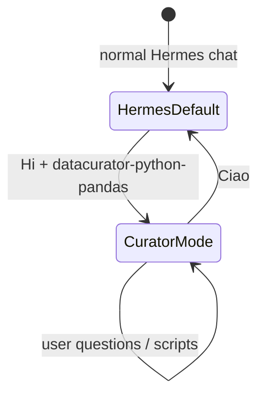
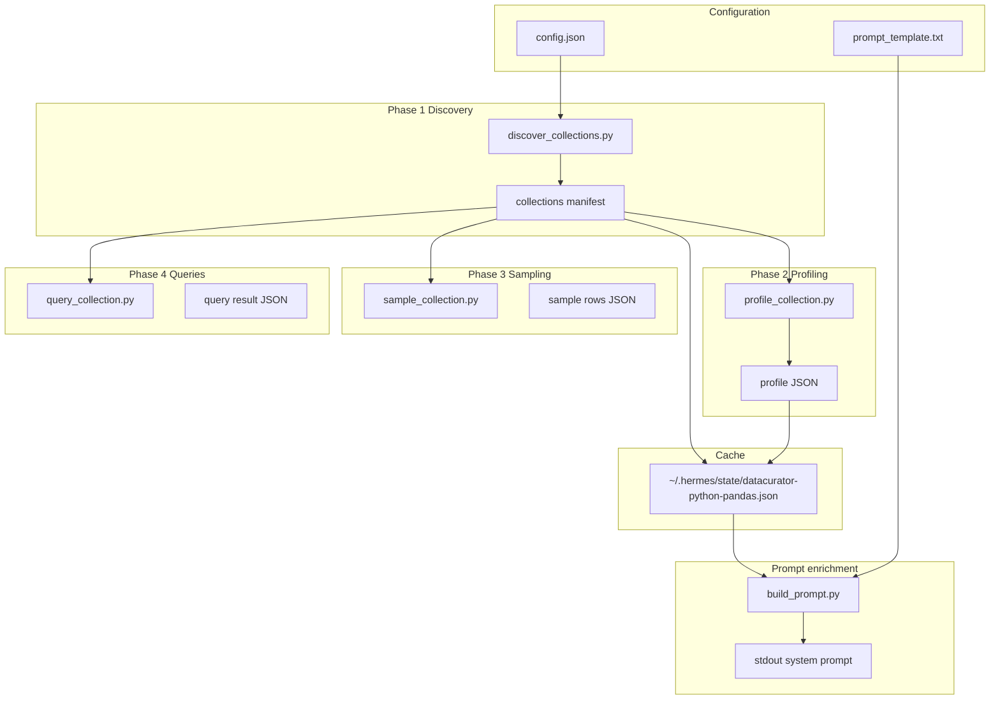

# datacurator-python-pandas — Implementation plan

**Location:** [`datacurator-python-pandas/PLAN.md`](PLAN.md) in the skill folder.

## Changes from v1

| Topic | Decision |
|-------|----------|
| **Naming** | Use `datacurator-python-pandas` everywhere: folder, skill name, state file, scripts |
| **Folder** | `data-curator/` renamed to `datacurator-python-pandas/` during implementation |
| **Queries** | CLI-only (no MCP server) |
| **Prompt** | User text in [`prompt_template.txt`](prompt_template.txt) kept; `{{COLLECTIONS_BLOCK}}` filled by `build_prompt.py` |
| **Activation** | `Hi` + `datacurator-python-pandas` → delegate `build_prompt.py` stdout as session system prompt; chat in curator mode |
| **Deactivation** | `Ciao` / `ciao` → restore default Hermes model/prompt |

---

## Session lifecycle (activate / deactivate)



| Trigger | Match (case-insensitive) | Agent action |
|---------|--------------------------|--------------|
| **Activate** | Message starts with `hi`, contains `datacurator-python-pandas` | `discover_collections.py` → `build_prompt.py` → set stdout as **system prompt** for delegated model; `datacurator-python-pandas.session_active=true` |
| **Work** | While session active | Curator persona + CLI scripts; do not drop enriched prompt mid-session |
| **Deactivate** | Message is exactly `ciao` (trimmed) | `datacurator-python-pandas.session_active=false`; restore original Hermes system prompt/model |

Rationale: collection context (TXT descriptions, profiles, samples) is large; delegating one system prompt to the session model preserves context richness without repeating it in every Hermes turn.

Documented in [`SKILL.md`](SKILL.md) and [`README.md`](README.md).

---

## Starting point

| File | Status |
|------|--------|
| [`config.json`](config.json) | `csv_source_folder_global_path`, `prompt_template` |
| [`prompt_template.txt`](prompt_template.txt) | Role prompt (lines 1–11); `{{COLLECTIONS_BLOCK}}` filled at runtime |
| [`csv_source_folder_global_path/`](csv_source_folder_global_path/) | Gitignored; example `Algae and Protists/` |

**Target enrichment format** (per collection):

```
Our collections are:
- name: "Algae and Protists"
  description: "Specimen records of algae and protists …"
  profile_summary: "320 rows, 53 columns; structured text columns: …"
  sample_rows:
    - { "Taxon": "…", "Barcode": "…", … }
    - …
```

(`description` from `.txt`; `profile_summary` and `sample_rows` from phases 2 and 3.)

Reference pattern: [`siyuan-daily-note/SKILL.md`](../siyuan-daily-note/SKILL.md).

Query inspiration: [mcp-csv-database](https://pypi.org/project/mcp-csv-database/) — read-only, per-collection, via custom CLI.

---

## Target architecture



**Agent workflow:** User says `Hi datacurator-python-pandas` → `discover_collections.py` → `build_prompt.py` → **delegate stdout as system prompt** → curator chat via `query_collection.py` → user says `Ciao` → restore Hermes default.

---

## Planned folder layout

```
datacurator-python-pandas/
├── PLAN.md
├── SKILL.md
├── README.md
├── config.json
├── prompt_template.txt      # base text; collection block inserted at runtime
├── requirements.txt
├── scripts/
│   ├── _lib.py
│   ├── discover_collections.py
│   ├── profile_collection.py
│   ├── sample_collection.py
│   ├── query_collection.py
│   └── build_prompt.py
└── references/
    ├── query-language.md
    └── profiling-fields.md
```

Repo `.gitignore`: `datacurator-python-pandas/csv_source_folder_global_path/`

---

## Configuration (`config.json`)

```json
{
  "csv_source_folder_global_path": "/abs/path/to/datacurator-python-pandas/csv_source_folder_global_path",
  "prompt_template": "./prompt_template.txt",
  "profiling": { "max_top_values": 10, "sample_rows_default": 8 },
  "query": { "default_limit": 100, "max_limit": 1000 }
}
```

---

## Phase 1 — Identify resources

**Script:** `scripts/discover_collections.py`

- Per subfolder of `csv_source_folder_global_path`: exactly one `.csv` and one `.txt`
- Collection name = folder name
- TXT content → `description` in the manifest

**State:** `~/.hermes/state/datacurator-python-pandas.json` with `collections[]`, `last_discovery_at`, `source_root`

---

## Phase 2 — Profiling

**Script:** `scripts/profile_collection.py --collection NAME`

Schema: row/column counts, dtypes, nulls, cardinality, duplicates, empty/high-null columns, string lengths, heuristic for `{...}` cells.

Cache: `profiles[collection_name]` in state.

---

## Phase 3a — Intelligent sampling

**Script:** `scripts/sample_collection.py --collection NAME [--n 8]`

Diverse rows (fingerprint + maximum deviation), not `head(n)`.

---

## Phase 3b / Phase 4 — Targeted queries (CLI)

**Script:** `scripts/query_collection.py`

Read-only pandas: `--where`, `--select`, `--groupby`, `--agg`, `--count-only`, `--distinct`, `--nulls`, `--limit`.

See [`references/query-language.md`](references/query-language.md).

---

## Prompt enrichment (`build_prompt.py`)

**Input:**

1. `prompt_template.txt` — base text with `{{COLLECTIONS_BLOCK}}`
2. State/manifest from `discover_collections.py` (or inline discovery if state is empty)

**Output rules:**

- `description` verbatim from `.txt` (trimmed, normalized newlines)
- No Python/MCP code in the final prompt
- stdout = complete system prompt; errors on stderr
- **v1: full_bundle** per collection:
  - `description` — from `.txt`
  - `profile_summary` — compact from profile (rows, columns, high-null columns, notable fields)
  - `sample_rows` — 2–3 diverse rows (key columns: Taxon, Barcode, Fundortbeschreibung, Typus when present)
- `build_prompt.py` runs profile + sample on demand or uses state cache

**SKILL.md:** On activate (`Hi datacurator-python-pandas`), agent runs discovery + prompt build, then delegates stdout as system prompt before the first curator reply. On `Ciao`, agent restores Hermes default and clears `datacurator-python-pandas.session_active`.

**MCP wording:** Lines 3–10 in `prompt_template.txt` still say “MCP client” / “MCP Server” per user preference; **technical** access is via CLI scripts (Hermes shell tools).

---

## `SKILL.md` — Frontmatter

```yaml
name: datacurator-python-pandas
description: Discover, profile, sample, and query Senckenberg collection CSVs read-only via bundled scripts.
prerequisites:
  commands: [python3]
```

---

## Implementation order

1. Rename `data-curator` → `datacurator-python-pandas`, update config + `.gitignore`
2. `_lib.py` + `discover_collections.py` + state
3. `profile_collection.py`, `sample_collection.py`, `query_collection.py`
4. `build_prompt.py`
5. `SKILL.md`, `README.md`, `PLAN.md`
6. Manual test

---

## Test plan

```bash
cd datacurator-python-pandas
python3 scripts/discover_collections.py
python3 scripts/build_prompt.py | head -40
python3 scripts/profile_collection.py --collection "Algae and Protists"
python3 scripts/query_collection.py --collection "Algae and Protists" \
  --where "Taxon.str.contains('Azadinium', case=False, na=False)" --limit 10
```

---

## Large CSV scale (disk vs context)

| Concern | Approach |
|---------|----------|
| CSV on disk | May be 100+ MB; **never** in model context |
| System prompt | **Max ~2 MB** (`prompt.max_total_chars` = 2 097 152) for template + collections block |
| Profiling on disk | ≥ **2 MB** file → sampled profile (`large_file_threshold_mb`: 2) |
| Query | Full pandas load in script only (RAM-bound); low `--limit`; future: DuckDB/Polars |

Documented in [`references/large-collections.md`](references/large-collections.md) and strengthened [`prompt_template.txt`](prompt_template.txt).

## Multilingual search

User-language terms alone miss rows. Agent expands each concept to **English + Latin/scientific stems** and uses regex OR in `str.contains` across multiple columns. Helper: `scripts/suggest_search_terms.py`. See [`references/multilingual-search.md`](references/multilingual-search.md).

## Out of scope (v1)

- MCP server / direct `mcp-csv-database` integration
- CSV write/export
- Automatic Hermes `config.yaml` changes
- Host-side implementation of model switching (documented as agent procedure; Hermes must support system-prompt override per thread)
- Chunked/streaming query engine for 100+ MB files (queries still load full CSV in pandas)
